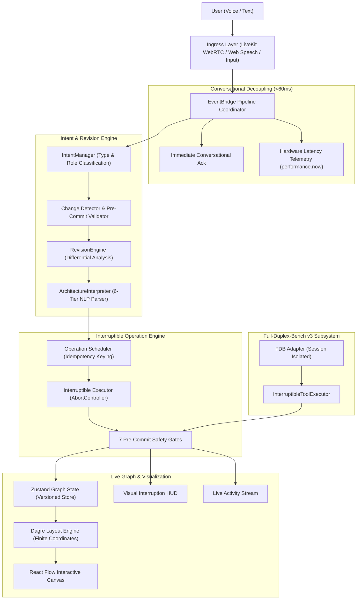

# MindSpace System Architecture

> **"Think out loud. Watch it evolve."**

MindSpace is a full-duplex, interruptible AI system architect that converts evolving user requirements into a live architecture graph.

---

## High-Level Pipeline

---

## Core Components

### 1. Ingress & Voice Abstraction Layer
- **`LiveKitVoiceProvider`**: Production WebRTC audio transport using LiveKit Agents.
- **`BrowserSpeechProvider`**: Native browser Web Speech API (`webkitSpeechRecognition` / `SpeechRecognition`) enabling in-browser voice input without external cloud credentials.
- **`MockVoiceProvider`**: Offline fallback for testing, automated grading, and headless environments.
- **`EventBridge`**: Coordinates speech start, interim transcripts, intent detection, and completion confirmation utterances without false completion calls.

### 2. Conversational Decoupling
- Emits immediate vocal acknowledgements (e.g. *"Got it — mapping that now."*, *"Understood, pivoting the architecture now."*) within <60ms.
- Separates conversational naturalness from heavy layout calculations and asynchronous operation execution.

### 3. Intent Detection & Revision Engine
- Detects intent type: `NEW_REQUIREMENT`, `MODIFICATION`, `CORRECTION`, `CANCELLATION`.
- **`ArchitectureInterpreter`**: Classifies requirements into 6 architectural tiers (`user`, `api`, `service`, `database`, `cache`, `queue`, `storage`, `agent`, `generic`) and builds connected DAGs.
- **`RevisionEngine`**: Evaluates new requirements against current topology. Supersedes stale components, preserves valid dependencies, and rewires topological connections.

### 4. Interruptible Operation Executor
- Executes operations (`ADD_NODE`, `ADD_EDGE`, `SUPERSEDE_NODE`, `SUPERSEDE_EDGE`) with `AbortController` cancellation tokens.
- Validates 7 pre-commit safety invariants before mutating state.

### 5. Zustand Graph Store & React Flow Canvas
- Centralized reactive store managing versioning (`v1`, `v2`, `v3...`), snapshots, and active operations.
- Renders through `@xyflow/react` with custom styled `ArchitectureNode` components and dynamic theme palettes.

### 6. Full-Duplex-Bench v3 (FDB-v3) Integration
- Connects benchmark tool calls directly to the same interruptible executor.
- Guarantees idempotency, in-flight argument correction, chained execution, and complete cross-scenario session isolation.
