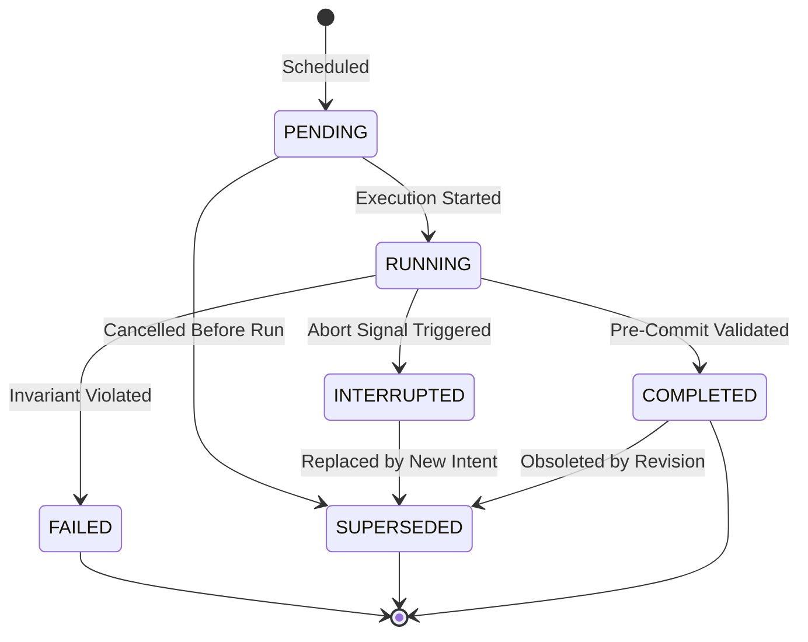

# MindSpace Interruption Model & State Machine

MindSpace implements full-duplex conversational interruption: when a user speaks or types a correction while an architecture is actively building, the engine immediately aborts stale in-flight work and replans without corrupting existing valid state.

---

## 1. Operation State Machine

Every atomic graph operation transitions through strictly validated lifecycle states:

### State Definitions
- **`PENDING`**: Operation is queued in the scheduler awaiting execution.
- **`RUNNING`**: Operation is actively executing its asynchronous work (e.g. provisioning simulation, layout compute).
- **`COMPLETED`**: Operation successfully satisfied all 7 pre-commit gates and mutated the Zustand store.
- **`INTERRUPTED`**: An in-flight operation received an `AbortSignal` due to incoming user correction.
- **`SUPERSEDED`**: Operation or its resulting entity was rendered obsolete and deprecated.
- **`FAILED`**: Operation encountered an error or failed invariant check; rolled back cleanly.

---

## 2. Abortable Operations (`AbortController`)

Every execution batch receives an `AbortController`. When an interruption occurs:
1. `operationEngine.interrupt(reason)` invokes `controller.abort()`.
2. All currently `RUNNING` operations observe `signal.aborted === true`.
3. The execution loop halts immediately and transitions active operations from `RUNNING → INTERRUPTED → SUPERSEDED`.
4. Stale operations are dropped from the active queue and never reach the mutation stage.

---

## 3. The 7 Pre-Commit Safety Gates

Before any operation mutates the graph store, it must pass 7 invariant validation checks in [`operationEngine.ts`](file:///C:/Users/user/.gemini/antigravity/scratch/mindspace/src/engine/operationEngine.ts):

1. **Existence Invariant**: Operation still exists in active registry.
2. **Status Invariant**: Operation status must be strictly `RUNNING`.
3. **Signal Invariant**: `AbortSignal.aborted` must be `false`.
4. **Intent Currency**: The operation's `intentId` must match the store's current active intent ID.
5. **Idempotency Guard**: The `idempotencyKey` has not already been committed in this graph version.
6. **Supersession Check**: Operation has not been marked `SUPERSEDED` by a concurrent replan.
7. **Base Version Validation**: The operation's `baseVersion` matches the store version at time of planning.

If any check fails, the mutation is rejected, zero side-effects occur, and no ghost nodes appear.

---

## 4. Visual Interruption HUD

When an interruption occurs, the canvas displays a color-coded status banner:

- **`USER_INTERRUPTED`** (Amber): Real-time vocal onset detected.
- **`STALE_PLAN`** (Rose): In-flight operations cancelled and marked superseded.
- **`REPLANNING`** (Cyan): Revision engine calculating minimal topological diff.
- **`NEW_INTENT`** (Indigo): New requirement displayed with strike-through of superseded intent.
- **`STATE_COMMITTED`** (Emerald): New graph version committed cleanly.
